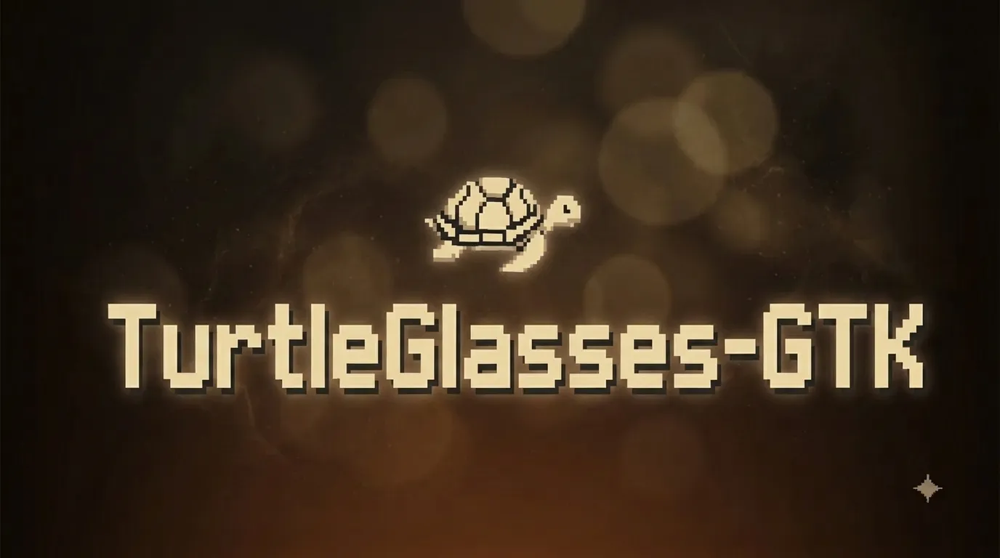
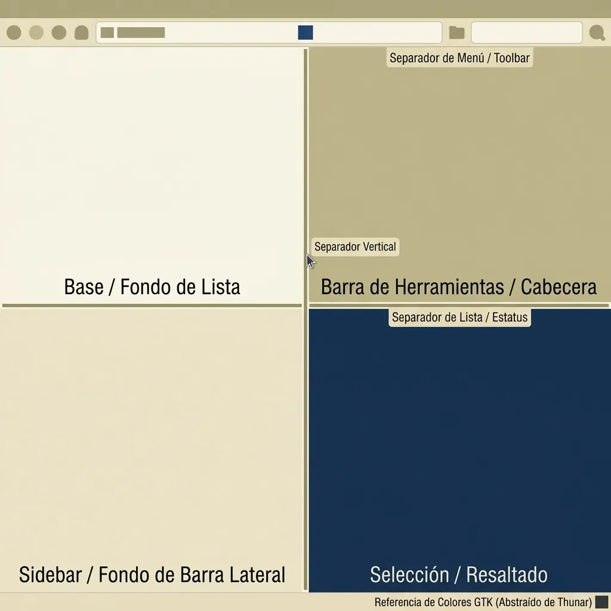

# TurtleGlasses-GTK

**Mi tema claro para GTK3**: beige/mármol con texto oscuro y acento navy. Hecho
para que toda la superficie de un widget se vea intencional, sin depender de los
valores por defecto de GTK.

Este es **mi tema personal**, creado y mantenido por **SbiDev**. Forma parte de
la familia de temas **TurtleGlasses**: comparte el acento navy `#2a3d5c` con el
tema homónimo para VSCode, para que el editor y el escritorio hablen el mismo
idioma visual.



## El tema

- Tema **claro** para aplicaciones **GTK3**: fondo beige cremita `#f0e9d2`,
  texto oscuro, superficies marfil y cromo, acento navy TurtleGlasses.
- Inspirado en **Kanagawa Lotus** y **Gruvbox Light**, pero con identidad propia.
- **Cobertura total de widgets**: botones, entries, menús, popovers, listas,
  scrollbars, infobars, CSD… nada queda sin estilo.
- **Cero dependencias, cero paso de build**: el CSS lo carga GTK directamente.
- **Verificado, no improvisado**: un harness (`tools/check-theme.py`) renderiza
  galerías offscreen y comprueba parseo, tokens, píxeles exactos y contraste WCAG.

### Alcance

- GTK3 solamente. Las aplicaciones GTK4/libadwaita ignoran el tema por diseño.
- Fuera de alcance actual (trabajo futuro):
  - soporte GTK4 y libadwaita,
  - una variante oscura.
- GTK resuelve el tema por el nombre de directorio `TurtleGlasses-GTK`,
  declarado también en `index.theme` bajo la clave `GtkTheme`.

## Por qué existe

La primera versión del tema era un único archivo de ~430 líneas con cobertura
parcial: cualquier widget sin estilizar caía a los valores por defecto de GTK y
rompía la armonía visual. Este rediseño (v2) lo convierte en un sistema:

1. **Capa de tokens semánticos** como única fuente de verdad del color.
2. **Parciales CSS modulares** con un parcial por familia de widgets.
3. **Reglas de rendimiento y nitidez** por píxel (bordes de 1 px, radios con
   escala fija, cero gradientes grandes).
4. **Harness de validación** que mide píxeles y contraste, no opiniones.

## Paleta

| Familia | Token | Valor | Uso |
|---|---|---|---|
| Superficies | `tk_bg` | `#f0e9d2` | Fondo de ventana — el ancla firmada del tema |
| | `tk_ivory` | `#faf7ec` | Áreas de texto (entries, views) |
| | `tk_chrome` | `#e9e0c3` | Headerbars, toolbars, pestañas |
| | `tk_panel` | `#e3d8b8` | Sidebars y paneles secundarios |
| | `tk_sunken` | `#dcd0aa` | Troughs y superficies hundidas |
| Acento | `tk_accent` | `#2a3d5c` | Navy TurtleGlasses: selección, foco, acentos |
| Texto | `tk_fg` | `#2a2a2a` | Texto principal |
| | `tk_fg_secondary` | `#555555` | Texto secundario |
| | `tk_fg_muted` | `#857e70` | Texto atenuado |
| Bordes | `tk_border` | `#b8b0a0` | Borde principal |
| | `tk_border_soft` | `#cdc6b6` | Separadores y bordes suaves |
| Semánticos | `tk_error` / `tk_error_text` | `#b85a7a` / `#813f55` | Forma / texto (AA) |
| | `tk_warning` / `tk_warning_text` | `#a67c1c` / `#7f6526` | Forma / texto (AA) |
| | `tk_success` / `tk_success_text` | `#5b7a4c` / `#4d6642` | Forma / texto (AA) |
| | `tk_info` / `tk_gold` | `#4d8fa8` / `#b8860b` | Información / acento dorado |

## Arquitectura modular

El punto de entrada es `gtk-3.0/gtk.css`, que solo contiene los imports de los
parciales, en este orden exacto:

```
gtk-3.0/gtk.css              ← solo @imports, sin reglas propias
gtk-3.0/parts/00-tokens.css  ← única capa de tokens y aliases
gtk-3.0/parts/01-base.css    ← base global
gtk-3.0/parts/02-chrome.css  ← estructura de chrome
gtk-3.0/parts/03-controls.css← controles interactivos
gtk-3.0/parts/04-views.css   ← vistas y listas
gtk-3.0/parts/05-menus.css   ← menús, popovers y popups
gtk-3.0/parts/06-scroll.css  ← barras de desplazamiento
gtk-3.0/parts/07-feedback.css← retroalimentación y estados
```

Para ajustar un widget se edita el parcial correspondiente y nada más;
`gtk.css` no crece.

## Contrato de tokens

- `parts/00-tokens.css` es la única fuente de verdad de color. Los parciales
  consumen tokens con la sintaxis `@token` y jamás escriben literales de color
  (ni siquiera en comentarios: el harness lo verifica).
- Transparencias con `alpha(@token, valor)`; no se introducen `rgba()`/`rgb()`
  fuera de la capa de tokens.
- El token del fondo de ventana (`tk_bg`) es el ancla firmada del tema y no se
  toca; todos los demás colores derivan de él.
- La capa semántica tiene dos niveles:
  - **FORMA** (`tk_error`, `tk_warning`, `tk_success`, `tk_info`, `tk_gold`):
    rellenos, bordes e indicadores no textuales, contraste mínimo 3:1;
  - **TEXTO** (`tk_*_text`): texto semántico (errores, infobars, texto sobre
    `entry.warning`), contraste AA de al menos 4.5:1 sobre beige y marfil.
  - Regla: nunca usar la capa FORMA como color de texto.
- `00-tokens.css` incluye el bloque de aliases GTK estándar obligatorio
  (`theme_*`, `borders`, `error_color`, `success_color`, `wm_*`, etc.), siempre
  aliasados a tokens `tk_*`, nunca redefinidos con hex.

## Reglas de rendimiento y nitidez

**Rendimiento (por frame):**

- Cero gradientes en superficies grandes; solo relleno sólido.
- Cero sombras con blur en superficies grandes. Blur permitido solo en
  superficies pequeñas flotantes (popovers, menús, tooltips), máximo 8 px.
- Transiciones solo sobre `background-color`, `border-color` y `color`, con
  duración máxima de 150 ms.

**Nitidez (cada píxel cuenta):**

- Bordes de 1 px entero (prohibidos decimales), con color sólido de token
  (nunca `alpha()` en bordes estructurales, para evitar antialiasing difuso).
- Radios en escala fija: 3 px controles densos, 6 px botones y entries,
  9 px popovers y menús, 12 px CSD.
- Anillo de foco con `outline-offset: -4px` y `-gtk-outline-radius` igual al
  radio del widget: no desplaza el layout ni recorta las esquinas.

## Notas de plataforma verificadas (GTK 3.24.49)

Medidas por píxeles sobre el build actual; condicionan el CSS y sustituyen
cualquier suposición previa:

1. La superficie pintable del scrollbar es el nodo `scrollbar`, no `trough`.
   El track se declara en `scrollbar:hover` y `trough` queda transparente de
   forma explícita; mover el track a `trough` dejaría de pintarse.
2. En la barra clásica (overlay desactivado) los steppers de los extremos son
   nodos `button`. Sin anulación total heredan la regla genérica y ensanchan la
   tira de 12 px a 18 px; el harness verifica 0 píxeles de color de botón.
3. El `trough` de `switch` y `scale` sí pinta; la excepción es únicamente la
   barra de desplazamiento.
4. En el render offscreen el slider del scrollbar se dibuja a tamaño completo:
   artefacto del orden de asignación, no un defecto. La verificación se apoya
   en colores y anchos, nunca en la longitud del slider.
5. `font-family` en el tema es inerte: el valor `gtk-font-name` del usuario
   gana incluso a prioridad THEME; el tema no declara ninguna familia.

## Verificación

Desde la raíz del tema:

```
python3 tools/check-theme.py
```

El harness renderiza galerías offscreen con `gtk-theme-name=TurtleGlasses-GTK`
y comprueba: 0 errores de parseo, los 8 imports, ausencia de literales de color
fuera de `parts/00-tokens.css`, el píxel ancla del fondo de ventana, bordes de
botón de exactamente 1 px, la barra clásica sin steppers (tira de 15 px y
slider de 8 px) y 7 pares de contraste WCAG. Debe terminar con
«N passed, 0 failed» y código de salida 0.

Para recargar el tema en aplicaciones abiertas:

```
gsettings set org.gnome.desktop.interface gtk-theme 'Adwaita'
gsettings set org.gnome.desktop.interface gtk-theme 'TurtleGlasses-GTK'
```

O simplemente se reinicia la aplicación. Las aplicaciones GTK3 recién abiertas
cargan el tema desde `gtk-3.0/gtk.css` automáticamente.

## Instalación

```
cp -r TurtleGlasses-GTK ~/.local/share/themes/
gsettings set org.gnome.desktop.interface gtk-theme 'TurtleGlasses-GTK'
```

Reinicia las aplicaciones GTK3 abiertas para ver el cambio. Bajo Niri no se
necesita xfwm4: las aplicaciones GTK3 dibujan su propia barra de título, por
eso los selectores CSD son críticos.

## Licencia

MIT — Copyright (c) 2026 SbiDev. Ver [LICENSE](./LICENSE).